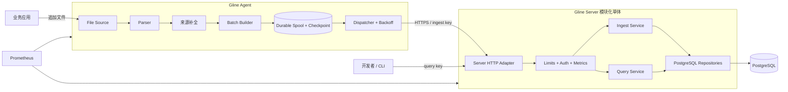
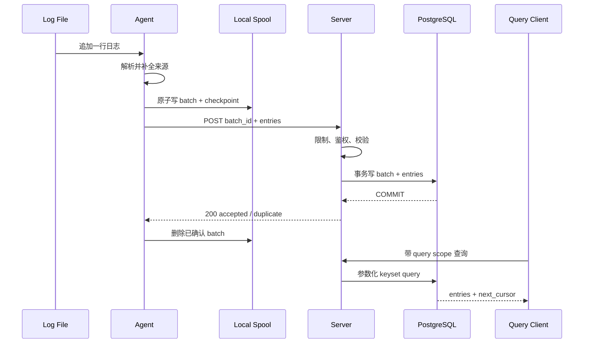

# 00. 系统全景：定位、体验与架构

本文用一篇文档回答三个问题：Gline 最终是什么，用户如何使用，以及系统为什么采用这样的架构。它是系列文档的入口；具体协议、数据表、故障语义和开发任务仍以对应专题文档为准。

> 状态说明：除“当前基础”小节外，本文描述的都是**目标体验和目标架构**，不代表当前工作树已经实现。实际进度见[现状评估](./01-current-state-assessment.md)和[开发路线图](./06-development-roadmap.md)。

## 1. 一句话定位

> Gline 是一个面向个人项目和小型服务集群的自托管日志采集与检索平台：Go Agent 从文件可靠采集日志，Go Server 完成项目隔离、幂等接入、PostgreSQL 持久化与条件查询，并用指标证明积压、恢复和性能行为。

它试图填补的使用空间是：

```text
直接登录服务器 grep
        <---------- Gline ---------->
                                   完整 Elastic / Loki 平台
```

相比 `grep`，Gline 提供跨机器汇总、统一结构、条件查询、故障恢复和运行指标；相比大型日志平台，它刻意减少部署组件、查询能力和运维范围。

Gline 不以替代 Filebeat、Vector、Loki 或 Elasticsearch 为目标。它只完成一个小型系统最需要、同时最能体现后端工程能力的闭环。

## 2. 谁会使用它

| 角色 | 目标 | 主要入口 |
| --- | --- | --- |
| 采集接入者 | 把某台机器上的服务日志接入平台 | Agent 二进制、YAML 配置、`ingest` API Key |
| 日志使用者 | 按时间、服务、级别和关键词定位问题 | Query API、curl 或后续的外部可视化工具 |
| 平台维护者 | 部署、升级、观察积压和处理故障 | Docker Compose、健康检查、Prometheus 指标、结构化日志 |

同一个人可以承担全部角色。角色划分的意义是形成清楚的权限和体验边界：Agent 的 Key 默认只能写入，查询客户端的 Key 才能读取。

## 3. 最终使用体验

### 3.1 部署 Server

目标体验是从一个干净环境开始，通过 Compose 启动两个核心服务：

```text
docker compose up -d
  -> gline-server
  -> postgres
```

随后执行受控的初始化命令：

1. 创建一个 Project，例如 `demo`。
2. 创建一个只有 `ingest` scope 的 Agent Key。
3. 创建一个只有 `query` scope 的查询 Key。
4. `/readyz` 返回就绪，表明 Server 配置、数据库连接和迁移版本兼容。

Prometheus 和 Grafana 可以作为演示 profile 加入，但不应成为首次启动日志闭环的硬依赖。

### 3.2 接入一台机器

采集接入者下载一个 `gline-agent` 二进制，复制示例配置并修改日志路径、服务名和凭证来源。目标配置形态如下：

```yaml
version: 1

agent:
  id: host-a-agent
  state_dir: ./data
  log:
    level: info
    file: ./agent.log

pipelines:
  - id: orders-file
    service: orders
    host: host-a
    source:
      type: file
      params:
        path: ./orders.log
        start_position: beginning
        max_line_bytes: 65536
    parser:
      type: string_line
      params: {}

sender:
  type: tick_or_batch
  params:
    batch_size: 200
    flush_interval: 1s
  destination:
    type: gline
    params:
      url: http://127.0.0.1:8080/api/v1/batches
      token_env: GLINE_INGEST_TOKEN
```

这里的 `token_env` 是目标设计：秘密由环境或平台 secret storage 注入，不直接写在 YAML 中。

启动后，用户不需要在正常运行中手动维护 offset：

- 文件新增内容会被持续读取；
- rename/recreate 和 truncate 轮转按配置处理；
- Agent 重启后从持久化 checkpoint 恢复；
- 网络中断时批次保留在磁盘 spool；
- Server 恢复后自动发送积压；
- 永久协议错误进入 quarantine，而不是静默丢弃或无限重试。

### 3.3 查询一次线上错误

日志使用者通过 Query API 查询：

```http
GET /api/v1/entries?from=2026-08-23T00:00:00Z&to=2026-08-23T01:00:00Z&service=orders&level=ERROR&q=timeout&limit=100
Authorization: Bearer <query-key>
```

返回结果按 `(observed_at DESC, id DESC)` 稳定排序，并附带不透明 `next_cursor`。下一页继续携带 cursor，不使用会随页数增加而变慢、且容易产生页间漂移的 offset。

查询范围和 page size 有上限。Gline 的目标不是任意分析 DSL，而是让最常用的故障定位请求稳定、可预测。

### 3.4 观察一次故障恢复

当 Server 暂停一分钟时，目标体验不是“看起来没问题”，而是故障状态清楚可见：

1. Agent 上传开始退避重试。
2. `gline_agent_spool_bytes` 和 `gline_agent_oldest_pending_seconds` 增长。
3. 内存占用不会跟随积压无限增长。
4. Server 恢复后，待发送批次逐步下降至零。
5. 查询能够看到故障期间产生的日志。
6. 重复上传由 Server 的 batch 唯一约束消除，不产生重复 entry。

如果 spool 达到配置上限，默认停止继续读取并报告不健康，而不是静默覆盖。用户可以显式选择丢弃策略，但丢弃数量必须进入指标和高等级日志。

### 3.5 日常运维

平台维护者通过三个入口判断状态：

- `/livez`：进程事件循环仍可响应；
- `/readyz`：该实例可以安全接收流量；
- `/metrics`：接入量、延迟、积压、重试、查询和数据库状态。

Server 运行日志不记录用户日志正文、Authorization 或搜索词。Agent 对解析失败原文的记录策略可配置并默认收敛，避免日志平台自身扩大敏感信息暴露。

## 4. 目标架构



系统包含两个自研可执行程序：

- `gline-agent` 位于数据产生端，拥有文件、checkpoint 和 spool。
- `gline-server` 是无本地业务状态的模块化单体，拥有接入、查询、鉴权和运维接口。

PostgreSQL 是首个服务端持久化组件。MVP 不加入 Server 内存微批队列，也不先加入 Kafka：Server 只有在数据库事务已经提交后才返回成功，使 ACK 含义明确。

## 5. 一条日志的生命周期



关键可靠性边界：

- Source 读取不等于可靠：只有 batch 与 checkpoint 同事务进入 spool 后，Agent 才拥有崩溃恢复依据。
- HTTP 请求发出不等于成功：超时后使用同一 `batch_id` 重试。
- Server 收到 JSON 不等于成功：只有 PostgreSQL 提交后才 ACK。
- ACK 丢失不等于重复写入：`project_id + batch_id` 唯一约束和 payload hash 处理重试。

因此，对外准确表述是“至少一次传输，有效单次写入”，而不是笼统的 exactly-once 或零丢失。

## 6. 与现有工具的关系

| 能力 | Filebeat / Vector | Loki / Elastic | Gline 目标 |
| --- | --- | --- | --- |
| 文件采集与位点 | 成熟、覆盖面广 | 通常由采集端完成 | 只覆盖最常见文件场景，但把恢复语义做完整 |
| 传输与缓冲 | 成熟队列和重试 | 完整分布式接入 | 本地持久化 spool + HTTP batch |
| 存储与查询 | 发送至外部平台 | 专用日志存储与丰富查询 | PostgreSQL 支撑受限查询；实测需要时再演进 |
| 运维规模 | 面向生产大规模部署 | 多组件或集群化 | 单机/小集群、自托管、组件少 |
| 管理与 UI | 生态成熟 | 通常具备完整 UI | 不做 fleet 和完整检索 UI |

Gline 的差异不是功能更多，而是范围更窄、保证边界可读、部署简单，并且每个取舍都有测试和指标支撑。

## 7. 当前基础与最终差距

当前已经具备：

- 配置驱动的 Source、Parser、Sender、Destination 边界；
- 多 Pipeline 并发和单 Pipeline 故障隔离；
- Sender 失败时的全局取消；
- panic 边界恢复与堆栈日志；
- 按数量或时间发送批次；
- 基础 HTTP destination、上传 Handler 和组件测试。

尚未具备：

- 可复现的独立构建环境；
- Agent→Server 真实 HTTP 合同测试；
- PostgreSQL 持久化和查询；
- 真实 API Key、Project 与 scope；
- batch 幂等；
- 持久化 spool、checkpoint 与轮转；
- metrics、Compose、CI、故障报告和性能数据。

因此，今天适合称为“日志 Agent 与 Server 接入原型”，完成持久化闭环后才适合称为“日志平台”。

## 8. 规模边界与演进信号

当前不预设“单 Agent 五万行/秒”或“Server 数万行/秒”等未验证结论。完成基线后，通过固定实验获得实际舒适区：

| 维度 | 观察指标 | 首先采取的动作 | 可能的架构演进 |
| --- | --- | --- | --- |
| Agent 采集 | channel 使用率、source lag、spool 水位 | 调整 batch 和 IO，分析 profile | 拆分 Pipeline 或 Agent 实例 |
| Server 接入 | p95/p99、429、DB pool、WAL/IO | 批量 SQL、连接池和事务优化 | 持久化消息队列、独立 Ingest |
| 日志查询 | p95、扫描行、buffer hit、索引体积 | SQL/索引/时间范围优化 | 分区或 ClickHouse 查询存储 |
| 数据保留 | 删除耗时、表膨胀、磁盘水位 | 小批删除与 vacuum 策略 | 时间分区或列式存储 |

ClickHouse、消息队列和微服务都是合理的未来选项，但只有实测信号出现后才进入主架构。演进前后应保持外部协议和可靠性保证可解释。

## 9. 最终验收画面

一个完整演示应在五分钟左右展示：

1. Compose 启动 Server 与 PostgreSQL。
2. 创建 Project、ingest Key 和 query Key。
3. Agent 接入一个示例日志文件。
4. 写入 INFO、WARN、ERROR 和无法解析的行。
5. Query API 返回全部结果，来源与级别正确。
6. 暂停 Server 后继续写入，展示 spool 积压。
7. 恢复 Server，积压归零且结果无重复。
8. 重放相同 batch，数据库行数不变。
9. 用错误 scope、超大 body 和超大时间范围验证安全边界。
10. 展示指标、查询计划和带环境信息的性能报告。

这幅画面就是开发路线的终点。任何新功能如果不能增强该闭环或形成新的可验证用户价值，就不应优先进入 MVP。

## 10. 去哪里看细节

- 产品边界与简历价值：[产品定位与简历故事](./02-product-scope-and-resume-story.md)
- 模块边界和部署形态：[目标架构](./03-target-architecture.md)
- 协议、数据库和查询：[领域模型、API 与存储](./04-domain-api-and-storage.md)
- spool、轮转、故障与指标：[可靠性、安全与可观测性](./05-reliability-security-observability.md)
- 实施顺序与验收：[开发路线图](./06-development-roadmap.md)
- 演示和面试表达：[简历、演示与面试手册](./07-resume-demo-interview.md)

