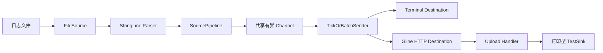

# 01. Gline 现状评估

## 1. 审计范围

本结论基于 2026-08-23 的本地工作树，而不只基于 `HEAD`：

- 分支：`master`
- 当前提交：`dce24fc`（`完成 Agent 配置与运行链路`）
- 提交数量：1
- Go 文件：42
- Go 代码与测试合计：约 2119 行
- 测试文件：8
- 工作树：存在未提交和已暂存修改，主要涉及 Server 原型、Agent 日志上下文和 HTTP destination
- 仓库当前无远程地址、README、License、CI、容器编排、数据库迁移和发布流程

本次审计没有修改现有业务代码。

## 2. 验证结果

当前工作树已通过：

```text
go build ./cmd/...
go test ./... -count=1
go test -race ./... -count=1
go vet ./...
```

环境使用 `go1.27.0 windows/amd64`，模块声明为 `go 1.26.5`。

这些结果证明代码能够构建，现有单元/组件测试通过，并且被测试路径未发现数据竞争。它们不能证明完整产品链路可用：Server 当前仍将日志交给打印型 `TestSink`，也没有查询入口。Server 运行态冒烟测试本次未完成；其端口硬编码为 `8080`，而本机该端口已由其他用户进程占用。

## 3. 当前架构



当前主要包职责：

| 路径 | 当前职责 | 评价 |
| --- | --- | --- |
| `cmd/agent` | 读取固定路径 `.glineconf`，构建并运行 Agent | 主链路已形成，但启动参数与资源关闭仍不完整 |
| `internal/agent/config` | 严格 YAML 解析、版本与必填项校验 | 是较好的边界，值得保留 |
| `internal/agent/build` | 根据配置组装 Source、Parser、Sender、Destination | 简单工厂足够当前规模，不需要容器框架 |
| `internal/agent/source` | 从文件尾部持续读取新行 | 能演示 tail，但没有断点、轮转和完整资源所有权 |
| `internal/agent/parser` | 解析 `LEVEL message` | 只有一种可用格式；结构化 JSON 文件仍是空包 |
| `internal/agent` | 多 Pipeline 并发、错误隔离、取消和 panic 恢复 | 当前最成熟、最有简历价值的部分 |
| `internal/agent/sender` | 按数量或时间聚合批次 | 已覆盖批量、定时、关闭和错误路径 |
| `internal/agent/destination` | 终端输出或 HTTP 上传 | HTTP 具备超时，但没有重试、幂等与响应错误模型 |
| `cmd/server` | Gin 路由、健康检查、上传路由 | 仅原型，配置和生命周期均未工程化 |
| `internal/server` | 非空 Authorization 检查 | 只是占位，不是鉴权实现 |
| `internal/server/modules` | JSON 解码并调用 Sink | 有基本组件测试，但输入边界较弱 |
| `internal/server/sink` | 接入接口与打印实现 | 接口方向合理，尚无持久化实现 |

## 4. 已有能力中值得保留的部分

### 4.1 Agent 生命周期语义清楚

当前实现已经处理了几个经常被简历项目忽略的问题：

- 单个 Source Pipeline 的致命错误不会自动拖垮其他 Pipeline。
- Sender 失败会取消所有 Pipeline，避免继续生产无人消费的数据。
- Pipeline panic 被边界恢复并记录堆栈，其他 Pipeline 可以继续运行。
- 外部取消时先停止生产端，再关闭 channel，使 Sender 有机会排空已经进入 channel 的数据。
- 临时 Source 错误与致命错误有明确分类。

对应测试覆盖了 Pipeline 错误隔离、panic 隔离、Sender 失败、取消排空和多 Pipeline 并发。这些是真实的并发生命周期合同，应继续保留。

### 4.2 配置采用严格解析

未知顶层字段会被拒绝，配置有版本号、必填字段和重复 Pipeline ID 校验。这比静默接受拼写错误更适合长期运行的 Agent。

### 4.3 组件边界不臃肿

`Source`、`Parser`、`Sender`、`Destination` 和 `EntrySink` 都是由真实替换需求形成的窄接口。当前没有必要引入通用工作流引擎、依赖注入框架或泛型策略层。

## 5. 阻碍成为简历项目的关键问题

这里的优先级表示“对形成可信项目闭环的阻碍”，不是线上事故等级。

### P0：仓库不能独立复现

`go.mod` 使用：

```text
replace github.com/isyuah/testx => E:/Proj/testx
```

其他人或 CI 没有该本机目录时无法解析依赖。简历项目的第一条底线是克隆后可构建。应优先用标准 `testing`、现有 `go-cmp` 或仓库内测试 helper 替换该依赖；不要把个人绝对路径留在公开模块中。

### P0：Server 接收到的数据没有持久化，也不能查询

`cmd/server` 注入的是 `sink.TestSink{}`，它只打印 entries。健康检查和上传返回 200 并不等于日志平台已经工作。没有持久化、检索、保留策略，就无法演示后端系统的核心价值。

### P0：Agent 与 Server 的协议没有集成保护

发送端和接收端各有代码，但没有一个真实 HTTP 测试证明 `GlineDest.SendEntries` 产生的 JSON、Header 和状态码与 Server 路由兼容。这是当前最小、最高价值的下一步测试。

### P1：当前传输语义会丢数据

Sender 遇到一次 destination 错误就退出，当前批次不重试；Agent 随即取消 Pipeline。与此同时：

- 文件读取位置只存在于进程内存中；
- Agent 启动时直接 seek 到文件尾部；
- 没有磁盘 spool 或断点；
- 没有批次 ID 和服务端幂等约束。

因此，Agent 离线期间已有的日志、发送失败时已经读过的日志、异常退出时内存中的日志都可能丢失。项目必须先明确语义，再谈“可靠采集”。

### P1：鉴权占位实现没有安全意义

当前中间件只判断 `Authorization` 是否为空，任何非空值都被接受，也没有项目隔离、吊销、轮换、审计和常量时间比较。示例配置还把 token 作为明文 YAML 字段。公开演示前应替换为真正的 API Key 模型。

### P1：HTTP 服务缺少生产边界

当前 Server：

- 地址与端口硬编码；
- 未配置 `ReadHeaderTimeout`、`ReadTimeout`、`WriteTimeout`、`IdleTimeout`；
- 没有优雅关闭；
- `/healthz` 只证明进程能响应，不证明数据库就绪；
- 请求体无限制，批次数量和单条消息大小无限制；
- 没有统一错误码、请求 ID、访问日志脱敏和限流。

### P1：日志模型不足以支持可靠接入与查询

当前 `LogEntry` 只有时间、级别、主机、消息、服务和动态 Data，缺少：

- `event_id` 或批次内序号，用于幂等；
- `project_id`，用于数据隔离；
- `agent_id`、`pipeline_id`，用于来源诊断；
- `ingested_at`，用于区分事件时间和接入时间；
- 协议版本与批次元数据；
- 明确的属性大小、层级和类型限制。

### P1：文件采集只覆盖最简单场景

`FileSource` 能等待新行和处理 CRLF，但尚未覆盖：

- 文件 truncate；
- rename + recreate 轮转；
- Agent 重启断点；
- 未换行尾部在文件长期不再写入时的处理策略；
- 超长行限制；
- 编码错误；
- Source 的 `Close` 生命周期。

### P2：项目交付面为空

还缺少 README、License、架构图、OpenAPI、Docker Compose、迁移、CI、版本发布、演示数据和性能报告。它们不是装饰，而是面试官判断“能否由其他人运行和维护”的主要证据。

### P2：依赖与命名有早期痕迹

- MongoDB driver 当前是间接依赖但没有实现使用者，不应让依赖暗示不存在的能力。
- `structedJson.go` 只有 package 声明，名称也应改为 `structured_json.go` 或在未实现前删除。
- `TestSink` 位于生产包并由 Server 主程序使用，容易让原型代码被误认为正式能力。
- 部分错误只拼接 `%s`，不保留可供 `errors.Is/As` 使用的错误链。
- 构建 Agent 时打开的日志文件以及 `FileSource` 没有统一关闭协议。

## 6. 当前成熟度判断

| 维度 | 当前等级 | 依据 |
| --- | --- | --- |
| Agent 并发与生命周期 | 可展示的原型 | 有稳定语义和针对性测试 |
| 配置与组装 | 可用原型 | 严格解析与校验已存在 |
| 数据接入 API | 接口原型 | Handler 测试通过，但协议未闭环 |
| 数据持久化 | 未实现 | 仅打印 Sink |
| 日志检索 | 未实现 | 无 Repository 和 Query API |
| 鉴权与隔离 | 占位 | 任何非空 Header 都通过 |
| 可靠传输 | 未实现 | 无重试、spool、checkpoint、幂等 |
| 可观测性 | 初始 | 只有 Agent 结构化日志和 Gin 默认日志 |
| 部署交付 | 未实现 | 无 Compose、CI、迁移、发布 |
| 简历可用度 | 暂不建议作为完成项目描述 | 可以描述 Agent 阶段，但不能声称完整日志平台 |

## 7. 一句话结论

Gline 已经有一个质量高于普通练手项目的 Agent 内核，但整体仍处于“传输前半段完成、后端闭环刚起步”的状态。正确路线不是扩大技术栈，而是把持久化、查询、鉴权、幂等和运行证据沿同一条数据链依次补齐。

