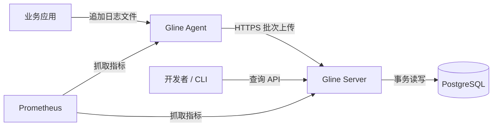
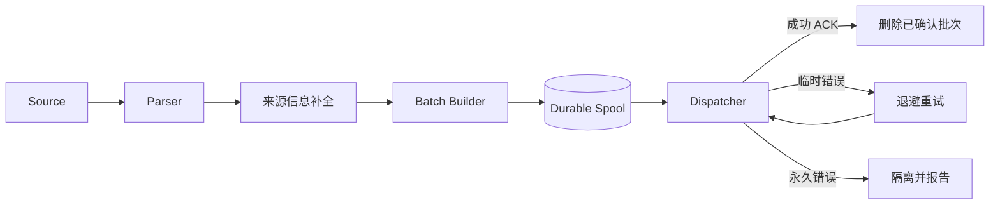
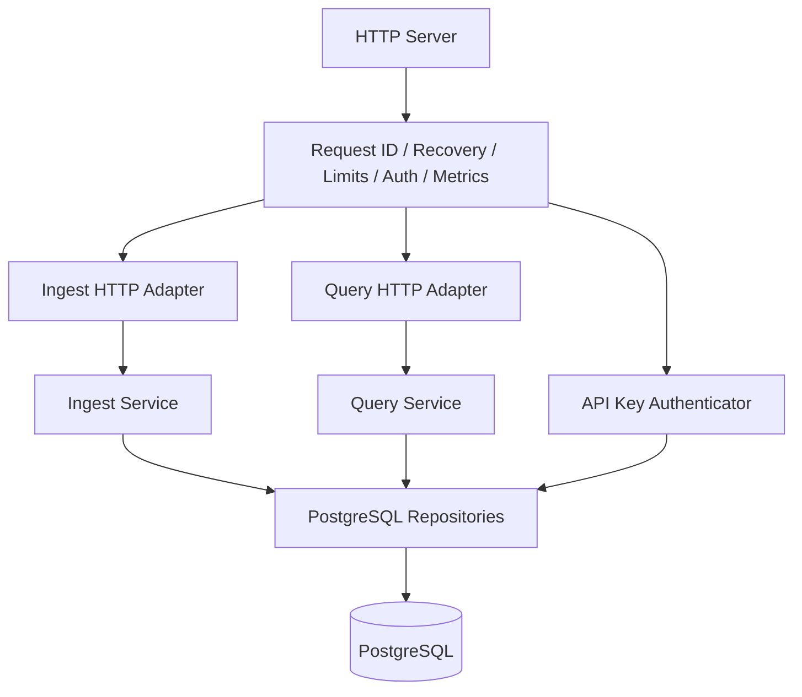
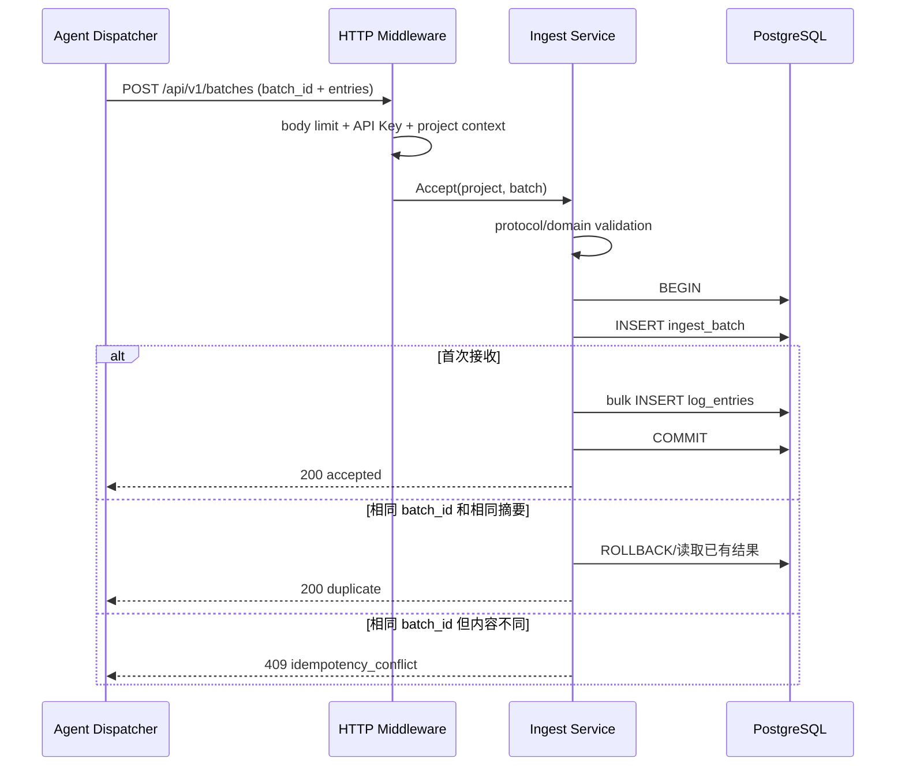
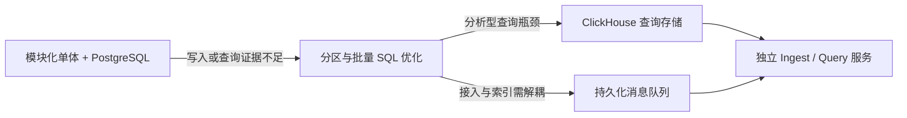

# 03. 目标架构

## 1. 架构原则

1. **先闭环，再拆分**：一个 Server 进程完成鉴权、接入、查询和运维接口；只有观测到独立扩缩容需求时才拆服务。
2. **确认语义优先**：HTTP 200 必须有明确含义，不能在数据仍可能静默消失时返回成功。
3. **有界资源**：channel、请求体、批次、重试等待、spool、查询范围和分页全部有界。
4. **协议模型与内部模型分离**：JSON DTO 可以版本化，领域模型与数据库模型不被外部字段直接绑死。
5. **错误可分类**：调用者必须能区分可重试、不可重试、鉴权失败、限流和服务未就绪。
6. **默认单机可部署**：开发和演示只依赖 Agent、Server、PostgreSQL；可选组件不能成为主链路前提。
7. **用证据驱动演进**：消息队列、ClickHouse、分片和微服务必须由实际吞吐、延迟或隔离需求触发。

## 2. 目标上下文



目标系统只有两个自研可执行程序：

- `gline-agent`：部署在日志产生节点，负责采集、解析、可靠缓冲和上传。
- `gline-server`：提供接入、查询、鉴权、健康和指标接口。

PostgreSQL 是首个外部状态组件。Prometheus 在开发阶段可以只抓取或直接查看文本指标，不是功能闭环的硬依赖。

## 3. Agent 内部架构



### 3.1 组件职责

| 组件 | 职责 | 不负责 |
| --- | --- | --- |
| Source | 从文件产生带观察时间和来源位置的 RawRecord | JSON 解析、网络发送 |
| Parser | 把 RawRecord 转换为结构化 Entry | 重试、存储 |
| Enricher | 添加 agent、pipeline、service、host 等可信上下文 | 覆盖 Server 确定的 project |
| Batch Builder | 按条数、字节数、时间构建不可变批次 | 直接删除数据 |
| Durable Spool | 在本地事务性保存待发送批次 | HTTP 状态解释 |
| Dispatcher | 上传、分类响应、退避和确认删除 | 重新解析日志 |
| Checkpoint | 记录 Source 已安全进入 spool 的位置 | 代表 Server 已持久化 |

### 3.2 生命周期顺序

正常启动：

1. 解析并校验配置。
2. 打开日志、spool 与 checkpoint 存储。
3. 恢复未确认批次。
4. 启动 Dispatcher。
5. 启动各 Source Pipeline。
6. 暴露 Agent 健康与指标接口（若启用）。

优雅关闭：

1. 停止接收新的 Source 记录。
2. 将已形成的 batch 提交到 spool。
3. 在配置的 shutdown deadline 内尝试发送已有 batch。
4. deadline 到达后保留未确认 batch，关闭网络客户端。
5. flush checkpoint 与日志，关闭文件和 spool。

这要求把资源所有权从当前的隐式进程退出，提升为明确的 `Close`/`Shutdown` 合同。

### 3.3 背压

内存 channel 只负责解耦短期速度波动，不能承担可靠队列职责。推荐规则：

- 内存队列固定容量。
- batch 构建后先写 spool，再推进文件 checkpoint。
- spool 达到 `max_bytes` 时，默认停止从 Source 读取并暴露不健康/告警状态。
- `drop_oldest` 只能作为用户显式选择，并必须增加丢弃计数与高等级日志。
- 永远不允许无指标、无日志地丢弃。

## 4. Server 内部架构

Server 采用模块化单体，而不是把上传、查询、鉴权拆成网络服务。



### 4.1 建议的包布局

这是目标边界，不要求一次性机械搬迁：

```text
cmd/
  agent/
  server/
internal/
  protocol/
    ingestv1/          # 上传 DTO、错误码、协议级校验
  agent/
    runtime/           # 生命周期编排
    source/
    parser/
    batch/
    spool/
    checkpoint/
    transport/
  server/
    bootstrap/         # 配置、依赖组装、启动与关闭
    httpapi/           # router、中间件、错误映射
    ingest/            # 接入 use case 和接口
    query/             # 查询 use case 和接口
    auth/              # API Key 认证
    health/
  storage/
    postgres/          # 连接、事务、各 repository 实现
  platform/
    logging/
    metrics/
migrations/
deployments/
  compose/
```

### 4.2 依赖规则

- `cmd` 只负责读取进程配置、组装和启动，不包含业务规则。
- HTTP Handler 只处理传输层解码、校验调用和错误映射。
- `ingest`、`query`、`auth` 定义其需要的窄 Repository 接口。
- PostgreSQL adapter 实现这些接口，业务模块不直接依赖 SQL driver 类型。
- `protocol/ingestv1` 可以被 Agent transport 与 Server HTTP adapter 共享。
- 数据库 row struct 不直接作为 API response。
- 不建立一个包含所有方法的 `Store` 大接口。

## 5. 接入数据流



选择“数据库提交后响应 200”，使确认边界容易解释。MVP 不在 Server 内增加未经持久化的异步 channel；否则返回 202 后仍要解决进程崩溃导致的数据丢失。

## 6. 查询数据流

1. API Key 确定 `project_id`，客户端不能自行越权指定其他项目。
2. Handler 校验 `from/to`、过滤条件、limit 和 cursor。
3. Query Service 生成规范化查询对象。
4. Repository 使用参数化 SQL 和匹配索引执行。
5. 返回按 `(observed_at DESC, id DESC)` 稳定排序的数据和下一页 cursor。
6. 指标记录结果数、耗时和超时，不记录原始搜索关键词或日志内容。

## 7. 部署拓扑

### 本地与演示

```text
Docker Compose
  - gline-server
  - postgres
Host process or container
  - gline-agent
  - demo-log-writer
```

Agent 最好首先以主机进程运行，因为读取主机文件更贴近真实场景；Compose 可以提供第二种容器 volume 演示。

### 单机生产式部署

- 反向代理或平台负载均衡器终止 TLS。
- Server 保持无本地业务状态，可重启。
- PostgreSQL 使用持久卷和备份。
- 多个 Agent 使用不同 `agent_id` 和 API Key。
- Server 通过环境变量或配置文件获得数据库 DSN、Key pepper 和超时；秘密不进入仓库。

## 8. 为什么暂不使用消息队列

直接事务写 PostgreSQL 的优点：

- 成功响应语义明确；
- 部署组件少；
- 集成测试容易；
- 足以验证 MVP 的吞吐；
- Agent spool 已吸收短期 Server 不可用。

只有出现以下证据时才考虑 Kafka、NATS JetStream 等队列：

- 数据库写入延迟导致接入端长期超时；
- 接入与索引需要独立扩缩容；
- 同一日志批次需要多个独立消费者；
- 需要跨较长维护窗口吸收大量 Server 端积压；
- 测量表明单体进程的 CPU 或连接池成为瓶颈。

即使引入队列，也应保持外部协议不变，只把 Server 的“确认边界”改为持久化队列提交成功，并在文档中重新定义查询可见性。

## 9. 演进路径



演进顺序不是承诺。只要 PostgreSQL 在目标数据量下满足指标，就停在第一阶段；克制本身也是架构能力。

