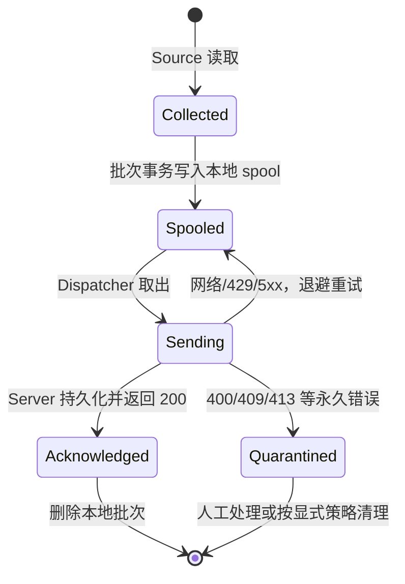

# 05. 可靠性、安全与可观测性

## 1. 可靠性目标

Gline 不应笼统宣称“不丢日志”或“exactly once”。推荐对外表达为：

> Agent 到 Server 采用至少一次传输；Server 通过项目内批次幂等实现重复重试下的有效单次写入。数据从 Source 进入本地持久化 spool 后，可以在进程或网络故障后恢复；超出 spool 容量、不可解析的永久协议错误和存储损坏有显式策略与指标。

这段描述给出了保证的起点、终点和例外。

## 2. 数据状态机



Source checkpoint 在 `Spooled` 后推进，而不是等 ACK 后推进。原因是 spool 已经承担恢复责任；如果等网络确认才推进，Agent 重启后会重复读取大量已安全落盘的数据。如果先推进 checkpoint 再写 spool，则两步之间崩溃会永久丢失。

## 3. Agent spool 设计

### 3.1 推荐实现

首版使用成熟的嵌入式事务 KV（例如 bbolt）保存不可变 batch，而不是自研二进制 WAL。建议 bucket：

```text
metadata
  schema_version
  next_sequence
batches
  <monotonic-sequence> -> encoded batch
checkpoints
  <pipeline-id> -> source identity + offset
quarantine
  <batch-id> -> batch + reason + first_failed_at
```

batch value 应包含完整可重试 HTTP payload 或足以确定性重建 payload 的数据。重试期间不能生成新 `batch_id`、改变 entry sequence 或重排 entries。

### 3.2 原子性

处理一批新记录时，在同一 spool 事务中：

1. 写入 batch；
2. 更新相关 Pipeline checkpoint；
3. 提交。

多个 Pipeline 共用一个 batch 会让 checkpoint 原子性更复杂。第一版可让每个 batch 只包含一个 Pipeline 的 entries，或者清晰记录每个 Pipeline 的安全 offset。不要为了少几个 HTTP 请求牺牲恢复模型。

### 3.3 容量策略

配置项：

- `max_bytes`
- `high_watermark_percent`
- `full_policy: block | drop_oldest`
- `quarantine_max_bytes`

默认 `block`。达到高水位时暴露 warning；达到上限时停止读取 Source，并让 readiness 失败。若用户显式选择 `drop_oldest`，每次丢弃必须记录 entry 数、byte 数和最老时间，不记录原始内容。

## 4. FileSource 与 checkpoint

checkpoint 至少包含：

- 规范化文件路径；
- 可用时的文件系统 identity；
- byte offset；
- 最近确认时间；
- 可选的小段内容指纹，用于辅助识别错误复用。

启动策略必须显式配置：

- `start_position: beginning`：无 checkpoint 时从头读；
- `start_position: end`：无 checkpoint 时只读新内容。

轮转处理：

| 情况 | 检测 | 行为 |
| --- | --- | --- |
| 原文件增长 | identity 相同且 size >= offset | 从 offset 继续 |
| truncate | identity 相同但 size < offset | 记录事件，按策略从 0 或 end 开始 |
| rename + recreate | 路径对应 identity 改变 | 尽量读完旧 handle，再打开新文件 |
| 文件暂时不存在 | open/not found | 临时错误，退避重试 |
| 权限永久失败 | permission denied | 致命 Pipeline 错误并暴露不健康 |
| 超长行 | 超过 `max_line_bytes` | 截断/隔离/拒绝，必须由配置明确 |

Windows 与 Unix 的文件 identity 获取不同，应通过小接口隔离平台实现，并使用真实文件轮转集成测试，而不是只 mock。

### 4.1 rename + recreate 的状态转换

路径与文件身份必须分开处理。检测到当前路径已经指向新 identity 后：

1. 保留旧文件 handle，并继续读到稳定 EOF。
2. 把新路径对应的文件加入待采集集合，避免旧文件迟迟不结束时漏掉新文件的大量写入。
3. 旧文件的最后一条记录进入 spool 后，保存其最终 checkpoint 并关闭 handle。
4. 新文件从自身 checkpoint 或配置的初始位置开始，不能继承旧文件 offset。

“稳定 EOF”不能只依赖一次读取结果。实现应结合短暂观察窗口、文件状态和 shutdown context，同时限制同时保留的旧文件数量，防止异常轮转导致 handle 无界增长。

### 4.2 copytruncate 的保证边界

检测到 identity 相同但 `size < offset` 时，可以判断文件被截断并从 0 继续。但 `copytruncate` 在“复制旧文件”和“截断原文件”之间存在窗口：该窗口中应用新写入的内容可能既未进入副本，也在 truncate 时消失。

这是轮转方式本身的竞态，Agent 无法仅靠 tail 完全消除。Gline 应：

- 支持并测试 truncate 后继续采集；
- 记录检测事件和可能的数据缺口；
- 文档推荐 rename + recreate；
- 不把 copytruncate 场景写成可证明的绝对零丢失。

### 4.3 半行与编码

- EOF 前没有换行的内容继续留在 pending buffer，不立刻产生 entry。
- 文件轮转或正常关闭时，是否提交最后半行必须由配置明确，并带 `partial` 属性。
- `max_line_bytes` 必须在持续追加但不换行的过程中生效，避免 pending buffer 无界增长。
- MVP 明确支持 UTF-8；非法字节采用替换、隔离或拒绝中的一种固定策略并暴露计数。

## 5. HTTP 重试分类

### 5.1 可重试

- 连接失败、DNS 临时错误、TLS 临时错误；
- 请求 context deadline；
- 408、425、429；
- 500、502、503、504。

退避建议：指数退避 + full jitter，初始 250 ms，最大 30 s。尊重合法的 `Retry-After`。所有等待必须可被 shutdown context 中断。

### 5.2 不可原样重试

- 400：payload 或协议错误；
- 401/403：凭证错误或被禁用；
- 409：相同幂等键对应不同内容；
- 413：请求过大，应在本地按规则拆分，无法拆分的单条 entry 进入隔离区；
- 其他明确的 4xx。

401/403 不应永久快速重试攻击 Server。保留 batch，降低频率或暂停 Dispatcher，并使 Agent readiness 失败，等待配置修复。

### 5.3 超时与取消

- 每次上传有单请求 deadline。
- shutdown 使用独立总 deadline；不能复用已取消的采集 context 去 flush。
- Server 未返回前，Agent 不知道事务是否提交；超时后必须用同一 batch ID 重试。
- Response body 即使不使用也应限量读取/丢弃并关闭，以便 HTTP 连接复用。

## 6. 故障矩阵

| 故障 | 预期行为 | 自动化证据 |
| --- | --- | --- |
| 一个 Parser panic | 该 Pipeline 停止，其他 Pipeline 继续 | 当前已有类似测试，补充 pipeline ID 日志 |
| 一个 Source 临时失败 | 可取消退避后重试 | 虚拟时间测试 |
| Server 断开 60 秒 | batch 留在 spool，恢复后发送 | 真实 HTTP 集成测试 |
| 请求提交后响应丢失 | 同 batch 重试，数据库无重复 | PostgreSQL 集成测试 |
| Server 返回 400 | batch 进入 quarantine，不热循环 | Agent transport 测试 |
| Server 返回 429 | 尊重 Retry-After | HTTP 集成测试 |
| Agent 在 spool commit 后崩溃 | 重启后恢复 batch | 子进程/故障注入测试 |
| 文件 rename + recreate | 旧文件尾部和新文件都被读取 | 临时目录集成测试 |
| PostgreSQL 不可用 | `/livez` 正常、`/readyz` 失败、上传 503 | Compose 集成测试 |
| Server 正在关闭 | 停止接新请求，等待在途事务 | 生命周期测试 |
| spool 满 | 默认阻塞采集并告警，不静默丢弃 | 小容量 spool 测试 |

### 6.1 确定性验证数据

故障实验使用合成日志生成器，每条记录包含连续序号和运行 ID，例如：

```text
INFO run=019... sequence=00000001 payload=...
```

验收工具从 Query API 拉取全部目标记录，按 `(run_id, sequence)` 检查：

- 缺失序号；
- 重复序号；
- 顺序变化；
- 从写入文件到可查询的恢复耗时。

数据库行数相等不足以证明没有缺失，因为“一条丢失 + 另一条重复”仍可能保持总数不变。

### 6.2 四个关键崩溃窗口

通过受测试配置启用 failpoint 或子进程协调，不在生产路径保留任意远程故障开关：

| 崩溃位置 | 重启后的正确结果 | 依据 |
| --- | --- | --- |
| Source 已读、spool 事务未提交 | 从旧 checkpoint 重读 | checkpoint 未推进 |
| spool 已提交、HTTP 未发送 | 从 spool 恢复并发送 | batch 与 checkpoint 同事务 |
| PostgreSQL 已提交、HTTP ACK 丢失 | 同 batch 重试，Server 返回 duplicate | 数据库唯一约束与 payload hash |
| Agent 已收到 ACK、本地 batch 未删除 | 重启后再次发送，最终仍只有一份 | 删除是可重复确认后的清理动作 |

这四个窗口全部通过，才足以支持“进程崩溃后可恢复”的表述。

### 6.3 文件与网络故障脚本

建议把可重复实验放在 `scripts/fault-inject/` 或集成测试中：

| 场景 | 操作 | 断言 |
| --- | --- | --- |
| rename + recreate | 写入一段、重命名、创建同名新文件并继续写 | 新旧 identity 的序号都可查询 |
| truncate | 写入、清空原文件、从头继续写 | 截断被检测，后续数据可查询，并报告潜在缺口 |
| 半行 | 分多次写入一行，最后再写换行 | 只产生一条完整 entry |
| 超长行 | 超过 `max_line_bytes` 且不换行 | 内存有界，执行配置的隔离/截断策略 |
| Server 中断 | 停止 Server 60 秒继续写入 | spool 增长后归零，无缺失/重复序号 |
| 429 | Server 返回 `Retry-After` | 实际重试不早于指定时间窗口 |
| 永久 400 | 返回稳定协议错误 | batch 进入 quarantine，不发生热循环 |

## 7. Server 安全基线

### 7.1 HTTP 边界

- TLS 在生产入口终止；文档明确明文 HTTP 只用于本地。
- 使用 `http.Server` 显式设置 header/read/write/idle timeout。
- 使用 `http.MaxBytesReader` 或等效机制限制压缩后的解码风险。
- 默认不接受 gzip；若后来支持，必须同时限制压缩体和解压后大小。
- JSON 解码拒绝未知字段和 trailing content。
- 对 batch、entry、字符串、attributes 和查询范围进行业务校验。
- Recovery 日志包含 request ID，不包含 body、Authorization 或原始日志内容。

### 7.2 授权与隔离

- Project 来自验证后的 API Key，不来自 query/body。
- 每条路由声明所需 scope；Agent Key 默认只有 `ingest`，不能读取日志。
- 所有 Repository 方法都必须显式接收 `projectID`。
- SQL 的第一层过滤始终包含 `project_id`。
- 集成测试用两个项目证明查询和幂等键互不影响。
- Key 可禁用和轮换；创建时只展示一次 secret。

### 7.3 数据与日志隐私

日志内容本身可能包含 PII、token 或业务秘密：

- Server 运行日志默认不记录上传 body、message、attributes 或搜索词。
- Agent 解析失败时当前会记录完整 `content`；公开或多用户部署前应改为可配置，并默认只记录长度、哈希或截断内容。
- 数据库备份、开发样例和 benchmark 数据使用合成内容。
- API 错误不回显数据库错误、文件路径或 secret。
- retention 与删除行为必须可观察。

### 7.4 滥用控制

按 key/project 进行令牌桶限流，分别限制：

- 请求数；
- entries 数；
- 解码后字节数；
- 查询并发与时间范围。

限流状态第一版可在单 Server 内存中；多实例后若需要全局精确配额，再引入共享存储。不要为未来多实例先增加 Redis。

## 8. 可观测性设计

### 8.1 结构化日志

所有组件统一字段：

```text
component, operation, request_id, project_id, agent_id,
pipeline_id, batch_id, error_kind, duration_ms
```

敏感字段采用内部 UUID 或短前缀；不记录 API secret 和日志正文。错误使用 `%w` 保留原因链，由边界统一记录一次，避免每层重复输出。

### 8.2 Agent 指标

建议 Prometheus 指标：

```text
gline_agent_records_read_total{pipeline}
gline_agent_records_parse_failed_total{pipeline}
gline_agent_batches_spooled_total
gline_agent_batches_sent_total
gline_agent_batches_retried_total{reason}
gline_agent_batches_quarantined_total{reason}
gline_agent_spool_bytes
gline_agent_spool_batches
gline_agent_oldest_pending_seconds
gline_agent_pipeline_up{pipeline}
gline_agent_upload_duration_seconds
```

避免把 service、host、batch ID、错误文本作为 label，防止基数爆炸。

### 8.3 Server 指标

```text
gline_server_http_requests_total{route,method,status_class}
gline_server_http_request_duration_seconds{route,method}
gline_server_ingest_entries_total{result}
gline_server_ingest_batches_total{result}
gline_server_ingest_batch_size
gline_server_db_operation_duration_seconds{operation}
gline_server_db_errors_total{operation,class}
gline_server_query_duration_seconds{filter_shape}
gline_server_query_rows
gline_server_auth_failures_total{reason}
gline_server_retention_last_success_timestamp_seconds
```

Project ID 默认不做 metric label；多项目环境会造成高基数，并可能泄露标识。

### 8.4 Trace

OpenTelemetry 放在持久化闭环之后实现。首版 trace 覆盖：

- HTTP server span；
- 鉴权数据库查询；
- ingest transaction；
- bulk insert；
- query SQL。

Agent 可发送 W3C trace context，但日志批次重试时一个批次可能有多个 HTTP attempt span。`batch_id` 作为 span attribute，不能把整个 batch 当作一条永久 trace。

### 8.5 健康检查

- `/livez`：事件循环可响应，不检查外部依赖。
- `/readyz`：配置完成、数据库 ping 在短 timeout 内成功、迁移版本兼容。
- `/metrics`：可配置独立监听地址，生产环境限制网络访问。

不要让 liveness 依赖数据库，否则数据库短暂故障会触发 Server 重启风暴。

### 8.6 pprof 与诊断端点

Agent 和 Server 可以提供默认关闭、显式启用的 `pprof` 监听器。它用于：

- 压测期间确认 CPU 是否消耗在 JSON、SQL、锁或日志格式化；
- 比较稳定负载前后的 heap；
- 在 Pipeline 反复启动/停止后检查 goroutine 是否回落；
- 用 block/mutex profile 验证背压是否产生非预期锁竞争。

诊断端点不与公开业务监听地址共享默认暴露范围。优化必须形成“profile 证据 → 修改 → 同条件复测”的链路，不能因为依赖树中已有高性能 JSON 库就提前切换。

## 9. 优雅关闭

Server 收到信号后：

1. 标记 not ready。
2. 调用 `http.Server.Shutdown`，停止接收新请求并等待在途请求。
3. 停止 retention 等后台 job。
4. 等待有界时间。
5. 关闭数据库连接池和 telemetry provider。
6. 超时则记录未完成组件并返回非零退出码。

Agent 的关闭顺序见目标架构文档。两个程序都应通过子进程或真实 signal 冒烟测试，不只测试单个函数。

## 10. 测试策略

### 保留的单元测试

- 生命周期状态与错误分类；
- batch 构建边界；
- retry 决策和退避上限；
- cursor 编解码；
- 协议/领域校验。

### 重点集成测试

- Agent transport 与 Server router 的真实 HTTP 合同；
- PostgreSQL 迁移、幂等事务、跨项目隔离和查询分页；
- spool 崩溃恢复；
- 文件轮转；
- Server 优雅关闭与数据库不可用。

### 少而关键的端到端测试

- 写日志文件后最终可从 Query API 查询；
- Server 中断期间产生的数据恢复后无重复；
- 错误 Key 无法写入和查询。

不要测试 Gin、`errors.Is`、JSON 标准库或简单 getter 本身。测试应保护 Gline 的故障语义和外部合同。

## 11. 性能验证方法

基准报告至少包含：

- Git commit；
- CPU、内存、磁盘、操作系统；
- Go、PostgreSQL 版本与配置；
- 数据量、消息大小、属性分布；
- batch size、并发连接数和测试时长；
- p50/p95/p99、吞吐、错误率、Server CPU/内存、DB IOPS；
- 查询 SQL 和 `EXPLAIN (ANALYZE, BUFFERS)`；
- 原始结果文件。

先分别测 ingest 和 query，再测混合负载。不要用一次短跑的峰值当作稳定吞吐。

### 11.1 实验矩阵

| 实验 | 主要变量 | 观察指标 | 要回答的问题 |
| --- | --- | --- | --- |
| Agent 吞吐 | 生成速率、行大小、Pipeline 数 | source lag、spool、CPU、内存 | 不积压时的稳定采集上限在哪里？ |
| batch 折衷 | batch size、flush interval | entries/s、上传 p95/p99、请求数 | 吞吐和实时性在哪个点平衡？ |
| Server 接入 | Agent/HTTP 并发、batch size | p95/p99、错误率、DB pool、IO | 瓶颈在 HTTP、编码还是数据库？ |
| Query | 数据量、时间窗口、过滤形状 | p95/p99、扫描行、buffer、plan | 哪些查询真正命中索引？ |
| 混合负载 | ingest/query 比例 | 两类延迟、资源竞争 | 查询是否影响接入确认？ |
| 故障恢复 | 中断时长、积压大小 | 恢复速度、重复/缺失、峰值资源 | 恢复是否会压垮 Server？ |
| 序列化 | 标准 JSON 与候选实现 | profile、吞吐、分配 | 更换库是否有可测收益？ |

每个实验先定义停止条件，例如错误率超限、spool 持续增长或查询 p99 超过目标。性能结果必须区分峰值和至少持续数分钟的稳定值。

### 11.2 结果呈现

README 只放最能说明结论的一张表和一到两张图，完整原始结果保存在版本化报告或 CI artifact 中。推荐结论格式：

```text
在 <commit / hardware / dataset / config> 下，系统稳定处理 <实测值>；
限制因素是 <profile / query plan 证据>；调整 <具体参数或实现> 后，
<指标> 从 <基线> 变化到 <结果>，代价是 <延迟/资源/复杂度>。
```

在数据产生前，文档只能写目标和方法，不能写“数万行/秒”“毫秒级”或“零丢失”。
