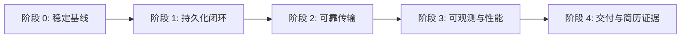

# 06. 开发路线图

## 1. 总体顺序



每个阶段都必须形成可解释、可验证、可回退的纵向切片。上一阶段没有通过验收时，不应同时引入下一阶段的大组件。

## 2. 阶段 0：稳定并封装当前基线

目标：让现有 Agent + Server 协议原型成为可独立构建、可继续演进的基线。

### GL-001 处理当前工作树边界

- 复查暂存区与未暂存区，确认哪些代码属于 Server 上传切片。
- 完成或明确移除 `cmd/agent_test` 的删除意图。
- 只提交该切片相关文件，避免 `.idea`、日志和缓存。
- 建立一个解释清楚的本地 checkpoint commit。

验收：`git status` 中剩余内容都能说明所有者和用途；该 commit 单独通过测试。

### GL-002 移除本机绝对路径依赖

- 用标准 `testing` + `go-cmp` 替换 `github.com/isyuah/testx`。
- 通过 `go mod tidy` 由 Go 工具更新 manifest/lock，不手工改 `go.sum`。
- 在一个没有 `E:/Proj/testx` 的环境或 CI 中验证。

验收：`go.mod` 无本地 `replace`，全新 clone 可执行 `go test ./...`。

### GL-003 固化 v1 最小上传合同

- 先建立共享 request/response DTO；本阶段可以暂时保持 `entries` 外形。
- 让 router 构造从 `main` 中提取为可测试函数。
- 使用 `httptest.Server`：真实 `GlineDest.SendEntries` 上传，recording sink 校验解码结果和 Authorization。
- 覆盖 Server 非 200 时 destination 返回可分类错误。

验收：一个测试跨越 HTTP 客户端、JSON、Header、Router、Handler 和 Sink。

### GL-004 收紧当前 HTTP 边界

- body limit；
- JSON unknown field 与 trailing content 拒绝；
- 非空 entries、最大 batch 数、字段基本校验；
- 统一错误结构；
- 明确当前临时 auth 只能用于开发。

验收：非法输入不会调用 Sink，响应不泄露内部解码细节。

### GL-005 修复启动与资源所有权

- Agent 支持 `-config`，Server 地址端口可配置。
- Server 使用显式 `http.Server` timeout 和 signal shutdown。
- Source、日志 writer、transport 和后续 spool 有明确关闭顺序。
- 修复构建中途失败时已打开资源未关闭的问题。

验收：两个二进制都有成功启动、信号关闭和非零配置错误的子进程冒烟测试或脚本证据。

### 阶段 0 完成条件

```text
go build ./cmd/...
go test ./... -count=1
go test -race ./... -count=1
go vet ./...
```

此外，全新环境无需个人路径即可通过；Agent→Server HTTP 合同受到测试保护。

## 3. 阶段 1：PostgreSQL 持久化与查询闭环

目标：一次上传在数据库提交后得到确认，并能被查询 API 返回。

### GL-101 引入配置与 Server bootstrap

- 定义 Server 配置：listen address、database URL、HTTP timeout、limits、auth pepper、shutdown timeout。
- 环境变量覆盖敏感项；日志打印配置摘要时脱敏。
- `main` 只负责 load、build、run。

### GL-102 Docker Compose 与迁移

- 通过包管理方式添加 PostgreSQL driver 和 migration 工具。
- Compose 只定义一个 PostgreSQL 和一个 Server，不创建平行数据库。
- 使用命名 volume；默认停止/重建不删除数据。
- 迁移是版本控制文件，Server readiness 检查 schema 兼容性。

### GL-103 Project 与 API Key

- 实现 projects/api_keys 表和 Repository。
- 提供开发期 CLI 或 seed 命令创建 Project/Key；secret 只显示一次。
- 中间件把 project ID 和 scopes 放入 context，分别校验 `ingest` 与 `query`。
- 添加无 key、错误 key、禁用 key、跨 project 的集成测试。

### GL-104 幂等批次写入

- 引入 `batch_id`、`agent_id`、`sequence` 和 payload hash。
- 事务写 batch 与 entries。
- 相同 batch 返回 duplicate；冲突内容返回 409。
- 使用批量 SQL，避免每 entry 一次往返。

### GL-105 查询 API

- 实现 `from/to/service/level/host/q/limit/cursor`。
- 使用 `(observed_at,id)` keyset pagination。
- 建初始组合索引。
- 两个 Project 的测试数据验证隔离。

### GL-106 端到端闭环

- 启动真实 PostgreSQL 和 Server。
- Agent destination 上传固定 batch。
- Query API 查询并比对结果。
- 重复上传，确认数据库行数不变。

### 阶段 1 完成条件

- Compose 新环境启动成功。
- 上传成功后数据持久化且可查询。
- 重启 Server 后数据仍在。
- 重复 batch 不产生重复 entry。
- 查询始终带 project 隔离和时间上限。
- README 有最小演示命令。

达到这里后，Gline 才形成第一个可称为“日志后端”的版本。

## 4. 阶段 2：Agent 可靠传输

目标：断网、Server 重启和 Agent 重启时，已进入可靠边界的数据能够恢复且不会重复。

### GL-201 Transport 错误分类

- 定义 `Temporary`、`Permanent`、`Auth`、`RateLimited`、`Conflict`。
- 解析稳定 Server error code 和 `Retry-After`。
- body 限量读取后关闭，保证连接复用。

### GL-202 指数退避

- full jitter；
- 可取消；
- 上限可配置；
- auth 错误不热循环；
- 测试不依赖真实 sleep。

### GL-203 持久化 spool

- 通过包管理器引入 bbolt 或经验证的替代方案。
- schema version、batch 顺序、容量统计、恢复和 quarantine。
- 先落 spool，再推进 checkpoint。
- crash/reopen 测试。

### GL-204 文件 checkpoint 与轮转

- `beginning/end` 初始位置策略；
- identity + offset；
- rename/recreate 时旧 handle 读到稳定 EOF，同时跟踪新 identity；
- truncate 后继续采集，并明确 copytruncate 无法消除的数据竞态；
- 半行关闭策略和 max line bytes；
- Windows 与 Unix 平台实现分离。

### GL-205 背压与关闭

- spool 水位与上限；
- 默认 block；
- shutdown deadline 内 flush，未确认数据留盘；
- 保证 goroutine、timer、file、response body 均释放。

### GL-206 故障端到端测试

- Server 暂停 60 秒；
- Agent 继续采集；
- 覆盖 spool 提交前、spool 提交后、数据库提交后 ACK 丢失、ACK 后本地删除前四个崩溃窗口；
- Server 恢复；
- 使用带 run ID 和连续序号的生成器检查缺失与重复，不能只比较数据库总数。

### 阶段 2 完成条件

- 文档能准确描述 guarantee boundary。
- 故障矩阵中核心场景都有自动化证据。
- 内存不会随 Server 不可用时间无限增长。
- 永久错误不会热重试或静默删除。

## 5. 阶段 3：可观测性、安全与性能

目标：能够解释系统在负载与故障下发生了什么，并给出可复现数字。

### GL-301 Prometheus metrics

- Agent spool、retry、pipeline 状态和 upload latency。
- Server HTTP、ingest、query、DB 和 auth 指标。
- 审查 label 基数。

### GL-302 健康与运行安全

- `/livez` 与 `/readyz` 分离；
- HTTP timeout、连接池、graceful shutdown；
- 迁移版本检查；
- 指标接口访问边界。

### GL-303 安全收紧

- Key 创建、禁用、轮换；
- HMAC + pepper；
- body/entry/query limits；
- 限流；
- 日志与错误脱敏；
- 安全测试与 threat model。

### GL-304 Retention

- 小批量删除；
- 上次成功与删除量指标；
- 失败重试；
- 恢复/备份文档。

### GL-305 基准与查询优化

- 可生成确定性测试数据；
- Agent 吞吐、batch 折衷、Server ingest、query、混合负载和恢复流量实验；
- 保存 raw result；
- 对核心查询保存 `EXPLAIN ANALYZE BUFFERS`；
- 用 pprof/数据库指标定位瓶颈，只根据证据更换 JSON 库、增加索引、分区或调整 batch。

### GL-306 OpenTelemetry（可选）

只有 metrics 和日志已足够稳定后再加入。先覆盖接入事务和查询，不追求全函数埋点。

### 阶段 3 完成条件

- 一次故障能通过指标定位到 Agent、HTTP 或 DB 层。
- 性能数字可由仓库脚本复现。
- 安全检查证明项目隔离和 secret 脱敏。
- 无法达到目标的指标也有诚实结论和改进记录。

## 6. 阶段 4：交付与简历证据

目标：让陌生人无需作者在旁即可理解、运行和验证项目。

### GL-401 项目首页

README 包含：一句话定位、架构图、关键保证、五分钟 quickstart、API 示例、指标截图/链接、局限和路线图。

### GL-402 CI

- format/check；
- build；
- unit test；
- race test（可独立 job）；
- PostgreSQL integration test；
- migration up/down 或重新建库验证；
- OpenAPI lint；
- Docker image build。

### GL-403 Release

- Agent/Server Windows、Linux 二进制；
- 镜像版本使用 commit/tag，不只使用 `latest`；
- changelog；
- 配置样例不含 secret；
- SBOM/漏洞扫描可作为加分项，不阻挡首个 release。

### GL-404 演示资产

- 合成日志生成器；
- 一键 demo；
- 故障演示步骤；
- benchmark 报告；
- API collection 或 curl 示例；
- 3 到 5 分钟演示脚本。

### 阶段 4 完成条件

- 新机器按 README 可完成端到端演示。
- CI 对主链路提供持续证据。
- Release artifact 对应当前源码。
- 简历描述中的每个技术事实和数字都能指向仓库证据。

## 7. 推荐迭代节奏

每个开发切片使用同一模板：

```text
问题：用户或系统会遇到什么失败？
合同：实现后什么必须保持为真？
设计：边界与所有权在哪里？
实现：只修改完成该切片所需的模块。
验证：最低成本的可靠证据是什么？
记录：README/ADR/API/benchmark 哪一项需要更新？
```

推荐一次只保持一个未集成的大切片。当前工作树已经包含跨 Agent 与 Server 的未提交修改，因此下一步首先应完成阶段 0 的基线整理，而不是同时开始数据库与 spool。

## 8. Now / Next / Later / Not Planned

| Now | Next | Later | Not Planned |
| --- | --- | --- | --- |
| 清理本地 replace | PostgreSQL 写入/查询 | 磁盘 spool/轮转 | 自研存储引擎 |
| Agent→Server 合同测试 | Project/API Key | Metrics/retention | 一开始拆微服务 |
| HTTP 限制与生命周期 | 幂等 batch | 性能与 trace | 一开始上 Kafka |
| 可配置启动 | Compose/E2E | ClickHouse 评估 | 完整日志分析 UI |

## 9. 建议的首批五个提交

提交应按行为边界组织，而不是按文件数量机械拆分：

1. `test: 使用标准测试依赖并恢复仓库可复现性`
2. `feat(protocol): 固化 Agent 与 Server 上传合同`
3. `feat(server): 增加有界 HTTP 服务与优雅关闭`
4. `feat(storage): 事务持久化幂等日志批次`
5. `feat(query): 增加项目隔离的游标分页查询`

每个提交都应能独立解释，且只在验证通过后成为下一阶段基线。
