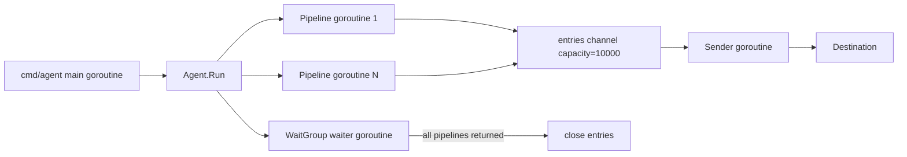

# 02. Go 并发与资源所有权

## 1. 本章目标

你不需要先成为 Go 并发专家，但必须能准确解释 Gline 当前和目标运行时的：

- goroutine 拓扑；
- channel 的生产、消费和关闭权；
- context 的取消方向；
- Pipeline 错误、panic、Sender 错误和外部信号的不同语义；
- 为什么优雅关闭不是简单地给所有 goroutine 同时 cancel；
- 文件、timer、HTTP body、spool、数据库连接和日志 writer 由谁关闭。

这部分是整个项目的根。后续 spool、HTTP 重试和 Server shutdown 都是相同所有权原则的具体应用。

## 2. 从当前代码画出运行图

当前核心位于：

- `internal/agent/agent.go`
- `internal/agent/sourcePipeline.go`
- `internal/agent/sender/tickOrBatch.go`

先不要改代码。按函数逐行画出：



逐项确认当前事实：

1. `Agent.Run` 创建一个共享 `entries` channel。
2. 每个 `SourcePipeline` 启动一个 goroutine。
3. Pipeline 从 Source 读取，Parser 解析，补全 host/service 后写 channel。
4. Sender 在单独 goroutine 中读 channel 并攒批。
5. Pipeline 集合全部返回后，waiter 关闭 channel。
6. Sender 在 channel 关闭时 flush 最后一批。

画图的目的不是文档美观，而是发现所有权：谁创建、谁写、谁读、谁关闭、谁等待。

## 3. Channel 所有权

### 3.1 基本规则

Gline 的 `entries` channel 有多个生产者、一个消费者。单个 Pipeline 不能关闭它，因为其他 Pipeline 可能仍在发送。Sender 也不能关闭它，因为消费者不知道未来是否还有生产。

因此关闭权属于“生产者集合的协调者”：

```go
var pipelineWG sync.WaitGroup

for /* each pipeline */ {
    pipelineWG.Go(func() {
        // produce entries
    })
}

go func() {
    pipelineWG.Wait()
    close(entries)
}()
```

这里的稳定合同不是“必须有一个 waiter goroutine”，而是：

> 只有在所有生产者都不可能再发送后，entries 才能关闭；消费者不负责关闭生产 channel。

未来可以换成其他结构，只要合同保持。

### 3.2 Channel 容量不等于可靠缓冲

`make(chan LogEntry, 10000)` 只能：

- 吸收很短的生产/消费速度差；
- 在进程存活时提供有界背压；
- 降低每条记录同步等待 destination 的开销。

它不能：

- 在进程崩溃后恢复；
- 表示 Server 已接收；
- 替代 spool；
- 证明一万条以内不会丢；
- 在 Sender 卡死时无限吸收文件增长。

后续目标是让 channel 只承担短期解耦，持久 batch 进入 spool。

### 3.3 发送端必须响应取消

Pipeline 写 channel 时使用：

```go
select {
case <-ctx.Done():
    return ctx.Err()
case entries <- entry:
    return nil
}
```

若直接执行 `entries <- entry`，Sender 停止且 channel 满时，Pipeline 会永久阻塞，Agent 无法关闭。

不要添加 `default` 让发送变成“满了就悄悄跳过”。如果产品允许 drop，它必须是显式策略、指标和日志事件。

## 4. Context 不是资源回收器

Context 适合传递：

- deadline；
- cancellation；
- request-scoped metadata。

Context 不负责自动：

- 关闭文件；
- 停止没有监听它的 goroutine；
- flush buffer；
- 回滚已经独立提交的事务；
- 删除 spool batch。

收到 `ctx.Done()` 后，组件仍要执行自己的关闭协议。

## 5. 当前 Context 树

当前 `Agent.Run` 大致形成：

```text
root ctx (signal)
  |
  +-- pipelineCtx = WithCancelCause(root)
  |
  +-- senderCtx = WithCancel(WithoutCancel(root))
```

### 5.1 为什么 Pipeline 继承 root cancel

收到进程信号后，应立即停止继续从 Source 读取新数据。Pipeline 的阻塞点都需要监听 `pipelineCtx`：

- 等待 Source 数据；
- 临时错误退避；
- 写入 entries channel。

### 5.2 为什么 Sender 暂时脱离 root cancel

如果 Sender 与 Pipeline 同时收到 cancel：

1. Pipeline 停止；
2. Sender 也立即返回；
3. channel 中已有的 entry 没有消费者；
4. 内存数据丢失。

`context.WithoutCancel(root)` 让 Sender 不直接继承信号取消。Pipeline 全部停止后 channel 关闭，Sender 才 flush 最后一批。

但 `WithoutCancel` 也带来责任：Sender 必须有另一个明确停止条件。当前是 channel close 或显式 `cancelSenderCtx()`；目标设计还需要 shutdown deadline。

### 5.3 目标设计中的变化

引入 spool 后，优雅关闭的首要合同不再是“无论多久都发完网络请求”，而是：

> shutdown deadline 到达前，所有已经从 Source 接受的完整记录至少进入本地持久化 spool；未获 Server ACK 的 batch 保留到下次启动。

目标 Context 关系可以表达为：

```text
process ctx
  +-- ingest ctx       停止 Source/Pipeline
  +-- persist ctx      允许 batch builder 把已接收记录写入 spool
  +-- dispatch ctx     在 shutdown deadline 内继续上传
```

不要机械增加三个 context。先明确三个生命周期，再选择最简单的实现。可能是顺序调用组件 `StopAccepting`、`FlushToSpool`、`Shutdown(deadlineCtx)`，比到处传 cancel 更清楚。

## 6. 五种退出路径

### 6.1 外部正常取消

```text
signal
 -> Pipeline 停止读
 -> 所有 Pipeline 返回
 -> entries 关闭
 -> Sender flush
 -> Agent 返回 context.Canceled
 -> main 将其视为正常退出
```

目标版本将“Sender flush”拆为“先保证入 spool，再在 deadline 内 dispatch”。

### 6.2 单个 Pipeline 致命错误

当前合同：

- 记录该 Pipeline 的错误；
- 该 Pipeline 返回；
- 其他 Pipeline 继续；
- Agent 进入部分可用状态。

这要求未来增加 `gline_agent_pipeline_up{pipeline}`，否则进程看似健康，某个服务却早已停止采集。

### 6.3 单个 Pipeline panic

panic 在 Pipeline goroutine 边界恢复：

```go
defer func() {
    if v := recover(); v != nil {
        logger.Error().
            Interface("panic", v).
            Bytes("stack", debug.Stack()).
            Msg("pipeline panicked")
    }
}()
```

当前代码使用 `WithLevel(FatalLevel)` 记录但不退出进程。重构时要避免误换成真正调用 `os.Exit` 的 Fatal API。

recover 不能散布在每个函数里：

- 会让状态损坏后继续执行；
- 难以判断哪一层负责恢复；
- 可能吞掉程序错误。

边界 recover 的含义是“终止本 Pipeline，保留其他 Pipeline”。

### 6.4 Sender/Destination 错误

当前 Sender 一次发送失败就返回，Agent 随即取消全部 Pipeline。这在没有 spool 时虽然会停机，但避免继续无限生产。

目标版本按错误分类：

- 网络、408/429/5xx：batch 保留，退避重试；
- 401/403：暂停发送并告警，等待凭证修复；
- 400/409/413：进入 quarantine 或执行明确拆批策略；
- spool 自身不可写：停止采集，这是本地可靠边界失败。

因此，未来“destination 一次失败 = Agent 返回”不再是稳定合同。

### 6.5 所有 Pipeline 自然结束

文件 tail Source 通常不会自然结束，但测试 Source 或未来 stdin Source 可能结束。所有 Pipeline 返回后应关闭输入、flush 并成功退出。不要让 Agent 因为只等待 root ctx 而悬挂。

## 7. 资源所有权表

为每个资源指定唯一 owner：

| 资源 | 创建者 | 关闭者 | 关闭时机 |
| --- | --- | --- | --- |
| Source file | Source builder | Pipeline runtime 或显式 Source owner | Pipeline 结束后 |
| temporary retry timer | 产生等待的函数 | 同一函数 | select 退出或 timer 触发后 |
| entries channel | Agent runtime | 生产者协调者 | 所有 Pipeline 返回后 |
| HTTP response body | Transport attempt | 同一 attempt | 读取/限量丢弃后立即关闭 |
| Agent log file | Agent bootstrap | Agent close stack | 所有使用者结束后 |
| spool DB | Agent bootstrap | Agent runtime | builder/dispatcher 停止后 |
| PostgreSQL pool | Server bootstrap | Server shutdown | HTTP 与后台 job 停止后 |
| telemetry provider | bootstrap | shutdown coordinator | 指标/trace flush deadline 内 |

一个资源若“进程退出自然会回收”，通常说明正常关闭和测试所有权还没有设计完整。

## 8. 让 Source 的关闭合同显式

当前 `FileSource` 有 `Close()`，但 `source.Source` 接口没有。这导致 Pipeline 无法通过接口保证释放文件。

一个直接方案：

```go
type Source interface {
    NextRecord(ctx context.Context) (RawRecord, error)
    Close() error
}
```

没有资源的测试 Source 可以实现 no-op Close。优点是 impossible state 更少：任何可运行 Source 都可关闭。

另一方案是构建时单独返回 `io.Closer`，适用于资源生命周期不等于 Source 生命周期的场景，但当前复杂度不需要。

不要在 `NextRecord` 每次调用中打开/关闭文件来回避所有权，那会破坏 tail 状态和性能。

### 8.1 Close 错误如何处理

- Pipeline 已有主错误时，Close 错误作为附加诊断记录，不覆盖根因；
- 正常结束但 Close 失败时，返回或聚合该错误；
- cancellation 本身不应让 Close 被跳过；
- 不在多层重复记录同一错误，选择拥有上下文最多的边界记录一次。

可以用 `errors.Join` 聚合独立清理错误，但只有调用者确实需要分类时才增加复杂性。

## 9. 构建中途失败的清理

`build.Agent` 可能依次打开日志文件、多个 Source、spool 和 HTTP transport。第 N 个组件构建失败时，前 N-1 个资源必须关闭。

一个简单 cleanup stack：

```go
type cleanupStack struct {
    funcs []func() error
}

func (s *cleanupStack) Add(fn func() error) {
    s.funcs = append(s.funcs, fn)
}

func (s *cleanupStack) Run() error {
    var errs []error
    for i := len(s.funcs) - 1; i >= 0; i-- {
        if err := s.funcs[i](); err != nil {
            errs = append(errs, err)
        }
    }
    return errors.Join(errs...)
}
```

这是可以考虑的小型内部 helper，因为它消除多资源构建中的真实重复。成功构建后把所有权转交给 Runtime，并清空 bootstrap 的 cleanup stack。

不要为了 cleanup 引入依赖注入框架。

## 10. 用状态而不是布尔组合表达生命周期

如果未来出现：

```go
running bool
stopping bool
closed bool
failed bool
```

这些布尔值可能形成矛盾组合。更适合定义内部状态：

```go
type runtimeState uint8

const (
    stateCreated runtimeState = iota
    stateRunning
    stateDraining
    stateStopped
)
```

但不要现在就为每个组件建立复杂通用状态机。只有当启动/停止可并发调用、状态需要对外暴露或错误恢复依赖它时，显式状态才值得。

## 11. 测试并发合同

### 11.1 适合保护的行为

- Pipeline A 失败后，Pipeline B 仍能产生记录；
- Pipeline A panic 后，B 继续，且日志有 panic origin；
- Sender 错误最终取消阻塞中的 Source；
- 外部取消后，已进入 channel 的记录被 Sender 看见；
- 所有 Pipeline 结束后 Sender 收到 channel close；
- temporary retry 可以被 context 立即中断；
- Source `Close` 正好在生命周期结束时发生。

### 11.2 避免真实 sleep

当前项目使用 `testing/synctest` 测试时间与并发，这是合适方向。测试步骤应由事件驱动：

```text
启动 Agent
等待 goroutine 全部进入稳定阻塞点
注入记录或错误
再次等待稳定
取消
断言结果
```

不要通过 `time.Sleep(100 * time.Millisecond)` 猜 goroutine 已经运行。慢 CI 会使测试随机失败，过长 sleep 又拖慢反馈。

### 11.3 不要测试实现顺序

如果合同是“取消后已接收记录不会丢”，不要断言具体 helper 调用顺序。未来 channel 变成 spool queue 时，用户行为不变，测试应继续有价值。

## 12. 常见错误

### 所有 goroutine 共用一个 cancel context

实现简单，但无法排空，也无法区分停止生产和停止发送。

### Sender 永远脱离取消

没有 deadline 或第二停止条件时，网络永久挂住会让进程无法退出。

### Pipeline 自己关闭共享 channel

多生产者场景会 panic。

### 用 recover 继续当前 Pipeline 循环

panic 后内部状态可能损坏。边界恢复应结束该 Pipeline。

### 忽略 Pipeline 返回错误

当前可以隔离错误，但仍要记录并更新健康状态。隔离不等于吞掉。

### 只在 main 最后 `defer Close`

若构建中途调用 `os.Exit`，defer 不执行；应让 `run() error` 返回给非常薄的 main，由 main 最后决定退出码。

## 13. 动手练习

在不改实现前，用文字完成：

1. 画出当前 Agent 的 context 树。
2. 标出 `entries` 的所有 send/receive/close 点。
3. 给每个打开文件写 owner。
4. 模拟外部 cancel、Pipeline fatal、panic、Sender error 四条时间线。
5. 解释加入 spool 后，为什么 Sender 的关闭目标会改变。

然后做一个小型实现切片：把 Source 关闭合同显式化，并只添加保护真实资源释放的测试。验证 build/test/race/vet。

## 14. 本章完成门

- [ ] 能不用看代码画出当前 goroutine 和 channel 拓扑。
- [ ] 能解释 entries 为什么由生产者协调者关闭。
- [ ] 能解释 `WithoutCancel` 解决什么问题、又引入什么责任。
- [ ] 每个长期资源都有唯一 owner 和关闭时机。
- [ ] Source 的关闭合同已经进入类型或明确 runtime 所有权。
- [ ] 并发测试不依赖任意真实 sleep。
- [ ] 能说出当前内存排空与未来持久化排空的区别。

下一步进入[协议与领域合同](./03-protocol-domain-contracts.md)，先定义 Agent 和 Server 共同遵守的边界，再分别演进两端。

