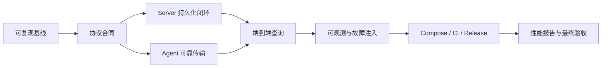

# Gline 完整实现教程

这套教程从当前工作树出发，目标是让你亲手把 Gline 实现到[系统全景](../00-system-overview.md)定义的最终形态。它不是一份“复制全部代码即可结束”的答案，而是一条可持续执行的学习路线：每一步都说明问题、定义、不变量、实现顺序、验证方法和完成门。

> 当前状态提醒：教程中的绝大多数代码和命令描述的是未来实现。只有章节明确标注“当前已有”的能力，才可以当作当前事实。实时状态以[现状评估](../01-current-state-assessment.md)和本地工作树为准。

## 1. 你最终会实现什么

完成全部章节后，系统应具有：

- 可独立构建和测试的 Go 仓库，不依赖作者机器上的绝对路径；
- 多 Pipeline 文件采集 Agent；
- 文件 checkpoint、rename/recreate 轮转与 truncate 检测；
- 本地事务 spool、不可变 batch、指数退避和有界背压；
- 版本化 HTTP 批次协议和稳定错误码；
- 模块化单体 Server、真实 API Key、Project 与 scope；
- PostgreSQL 迁移、批次幂等事务、日志持久化；
- 时间/服务/级别/主机/关键词过滤和 keyset pagination；
- retention、健康检查、Prometheus 指标和受控 pprof；
- 覆盖四个崩溃窗口的故障注入；
- Docker Compose、CI、Release 和可复现性能报告；
- 一条可在约五分钟内演示的正常链路和故障恢复链路。

## 2. 教程与设计文档的关系

```text
设计文档：系统必须满足什么，以及为什么这样决策
教程：    你按什么顺序理解、实现、测试和验收
源码：    当前真正存在的事实
测试/运行证据：当前真正成立的行为
```

发生冲突时，按下面的顺序处理：

1. 先检查当前源码和 Git diff，确认是否是实现已经演进。
2. 检查 ADR，确认架构决策是否已经正式替换。
3. 若设计未变，以设计文档中的稳定合同为准，修正教程或实现。
4. 若设计需要改变，先写或更新 ADR，再同步教程和路线图。

不能为了让旧教程继续成立而扭曲更合理的实现。

## 3. 章节地图

### 第一部分：学习与工程地基

| 章节 | 产出 |
| --- | --- |
| [00-怎样使用本教程](./00-how-to-use-this-tutorial.md) | 学习循环、证据等级、代码块约定和停止规则 |
| [01-建立可复现基线](./01-baseline-and-workflow.md) | 干净的依赖边界、基线命令、变更切片和进度记录方法 |
| [02-Go 并发与资源所有权](./02-go-concurrency-ownership.md) | 能准确解释当前 Agent 的 goroutine、channel、context 和关闭顺序 |
| [03-协议与领域合同](./03-protocol-domain-contracts.md) | v1 DTO、领域模型、错误码、batch 不变量和兼容策略 |

### 第二部分：Agent 可靠采集

| 章节 | 产出 |
| --- | --- |
| [04-Agent 运行时](./04-agent-runtime.md) | 清晰的 Pipeline/Sender 生命周期、错误传播和资源关闭 |
| [05-Spool 与 Checkpoint](./05-spool-checkpoint.md) | 本地事务状态、不可变 batch、恢复和容量策略 |
| [06-文件采集与轮转](./06-file-tail-rotation.md) | start position、identity、半行、rename/recreate、truncate |
| [07-发送、重试与背压](./07-dispatch-retry-backpressure.md) | HTTP 错误分类、退避、quarantine 和有界关闭 |

### 第三部分：Server 与 PostgreSQL

| 章节 | 产出 |
| --- | --- |
| [08-Server 启动与 HTTP 边界](./08-server-bootstrap-http.md) | 配置、Router、timeout、limits、统一错误和优雅关闭 |
| [09-Project 与 API Key](./09-auth-project-scopes.md) | ingest/query scope、HMAC 校验、禁用、轮换和隔离 |
| [10-PostgreSQL 与 Repository](./10-postgresql-repositories.md) | 迁移、连接池、事务边界、Repository 和索引基线 |
| [11-接入、查询与保留](./11-ingest-query-retention.md) | 幂等批次写入、keyset query、retention 和 OpenAPI |

### 第四部分：证明系统成立

| 章节 | 产出 |
| --- | --- |
| [12-可观测性](./12-observability.md) | 日志、低基数指标、健康检查和 pprof |
| [13-测试与故障注入](./13-testing-fault-injection.md) | 单元/集成/E2E 分层、四个崩溃窗口和序号校验 |
| [14-Compose、CI 与发布](./14-compose-ci-release.md) | 新环境可复现运行、持续验证和可追溯制品 |
| [15-性能验证与架构演进](./15-performance-evolution.md) | 基准方法、profile、查询计划和演进触发条件 |
| [16-最终集成与验收](./16-final-integration-acceptance.md) | 完整验收矩阵、演示、交付物和可用简历表述 |

辅助阅读：[术语表](./appendix-glossary.md)。

## 4. 不要跳过的完成门

教程不是必须逐字顺序阅读，但实现不能越过依赖门：



为什么 Server 持久化闭环先于完整 Agent spool：

- 当前最缺的是 Agent 与 Server 之间的真实 HTTP 合同；
- 没有持久化 ACK，Agent 的可靠重试无法形成端到端保证；
- 先完成一条简单、可查询的 Server 链路，可以尽早获得产品闭环；
- 之后再把 Agent 从“内存发送”升级为“持久化发送”，故障测试才有可靠终点。

协议设计可以先完成，Agent 和 Server 的内部实现可以在协议稳定后并行推进。

## 5. 每个开发切片的固定循环

```text
1. 读现状：源码、测试、git status、相关设计文档
2. 写合同：本次完成后什么必须为真
3. 设计失败：网络、取消、崩溃、无效输入时会怎样
4. 写最小高价值测试或验收脚本
5. 实现：只改该合同需要的模块
6. 静态验证：format / build / vet / targeted test
7. 动态验证：integration / race / process / compose / fault test
8. 复盘：记录结果、限制、未完成项和下一门
```

每章会告诉你哪些测试适合先写。不要机械地对每个函数做测试；测试的是 Gline 的稳定合同。

## 6. 推荐的学习记录

如果项目后续选择启用持久进度记录，可以在项目规则允许后维护一个开发日志。未启用时，每个切片至少在提交或 PR 描述中回答：

```markdown
## 问题

## 本次稳定合同

## 设计与取舍

## 验证

## 已知限制

## 下一完成门
```

不要只记录运行了哪些命令。记录这些命令证明了什么，以及没有证明什么。

## 7. 总验证命令

随着依赖增加，命令会扩展；始终保留最便宜的基础层：

```powershell
gofmt -w <本次修改的 Go 文件>
go build ./cmd/...
go test ./... -count=1
go test -race ./... -count=1
go vet ./...
```

`gofmt -w` 是机械格式化，可以直接执行，但只传入本次修改的文件或明确目录，避免不相关格式噪音。

数据库、Compose、故障和性能验证由后续章节增加。一次局部修改不必每次执行最昂贵的全套 E2E，但阶段完成门必须执行相应层级。

## 8. 教程完成的定义

读完不算完成。只有满足以下条件，才算走完教程：

- 所有章节的完成门有当前 commit 对应的证据；
- 最终 E2E 能从日志文件写入走到 Query API；
- Server 中断与进程崩溃场景无未解释的缺失或重复；
- 文档不把目标能力写成当前能力；
- README 中的性能数据有可复现报告；
- 新机器无需作者本地路径即可运行；
- 你能不用背稿解释 ACK、checkpoint、spool、幂等、索引、背压和演进条件。

